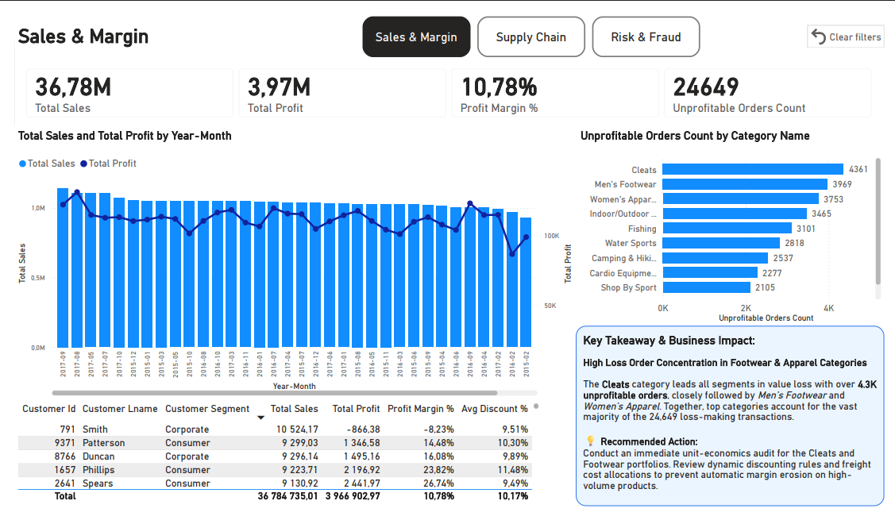
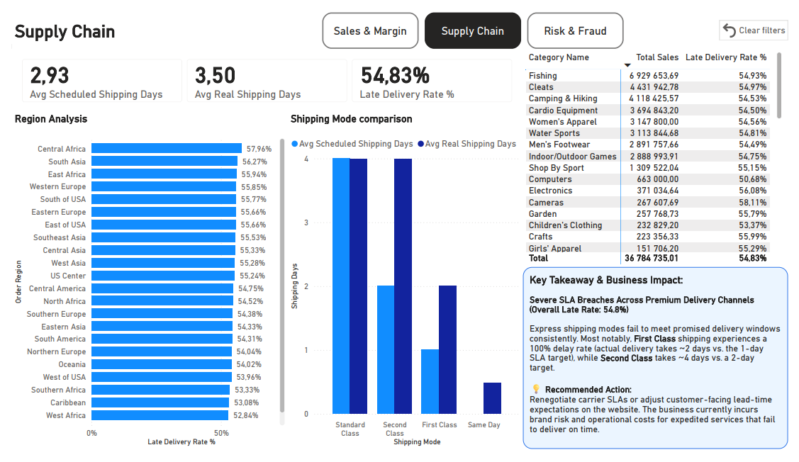
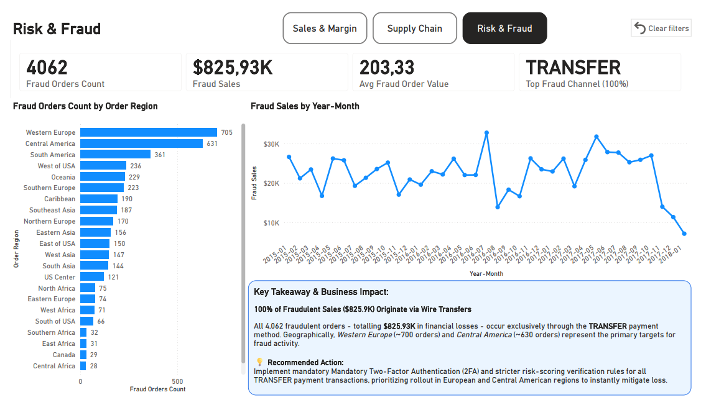

# 🚚 Supply Chain & Financial Risk Analytics Dashboard (Power BI)

## 📌 Executive Summary
This project provides an end-to-end executive-level overview of commercial performance, logistics efficiency, and financial risk for a global supply chain enterprise. Analyzing over **180,000 transactions** (DataCo Dataset), the dashboard identifies revenue leakage, logistics bottlenecks, and fraud patterns, offering actionable data-driven recommendations.

---

## 📊 Dashboard Pages & Key Insights

### 1. Sales & Margin Profitability

* **Insight:** High Loss Order Concentration in Footwear & Apparel Categories. The *Cleats* category leads all segments in value loss with over **4.3K unprofitable orders**.
* **Recommendation:** Conduct an immediate unit-economics audit for the Cleats and Footwear portfolios. Review dynamic discounting rules and freight cost allocations to prevent automatic margin erosion on high-volume products.

### 2. Supply Chain & Logistics SLA

* **Insight:** Severe SLA Breaches Across Premium Delivery Channels (Overall Late Rate: 54.8%). Express shipping modes fail to meet promised delivery windows consistently. **First Class** shipping experiences a 100% delay rate.
* **Recommendation:** Renegotiate carrier SLAs or adjust customer-facing lead-time expectations on the website to mitigate brand risk and operational costs.

### 3. Risk & Fraud Detection

* **Insight:** 100% of Fraudulent Sales ($825.9K) Originate via Wire Transfers. All 4,062 fraudulent orders occur exclusively through the **TRANSFER** payment method, primarily targeting Western Europe and Central America.
* **Recommendation:** Implement mandatory Two-Factor Authentication (2FA) and stricter risk-scoring verification rules for all TRANSFER payment transactions.

---

## 🛠️ Technical Stack & Methodology
* **Data Modeling:** Built a robust **Star Schema** (`1:*` relationships) separating fact and dimension tables (`Fact_Orders`, `Dim_Customer`, `Dim_Product`, `Dim_Calendar`) to optimize VertiPaq engine performance.
* **Data Transformation (Power Query):** Handled deduplication, staging queries, data type parsing, and conditional column creation.
* **DAX (Data Analysis Expressions):** 
  * Created dynamic Time Intelligence metrics and custom dynamic grouping.
  * Utilized `CALCULATE`, `DIVIDE`, and Context Transition for advanced KPIs (e.g., `Late Delivery Rate %`, `Profit Margin %`).
* **UI/UX Design:** Applied an executive, minimalistic design focusing on Data Storytelling, removing visual clutter, and implementing custom page navigation.

---
*Developed by Szymon Khrapachenko* | [LinkedIn Profile](https://www.linkedin.com/in/szymon-khrapachenko)
